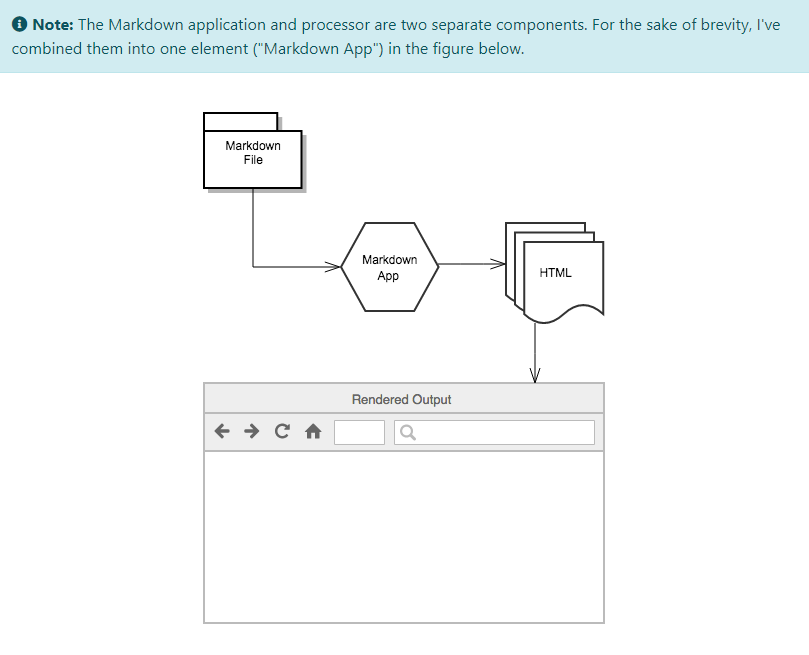

# Markdown
This repository is for practice of Markdown language.

## What is a Markup language?
A markup language is a computer language that uses tags to define elements within a document. It is human-readable, meaning markup files contain standard words, rather than typical programming syntax. While several markup languages exist, the two most popular are HTML and XML.

HTML is a markup language used for creating webpages. The full form of HTML is Hypertext Markup Language. The contents of each webpage are defined by HTML tags. Basic page tags, such as <head>, <body>, and <div> define sections of the page, while tags such as <table>, <form>, <image>, and <a> define elements within the page. Most elements require a beginning and end tag, with the content placed between the tags. For example, a link to the TechTerms.com home page may use the following HTML code:

`<a href="http://www.techterms.com">TechTerms.com</a>`

XML is used for storing structured data, rather than formatting information on a page. While HTML documents use predefined tags (like the examples above), XML files use custom tags to define elements. For example, an XML file that stores information about computer models may include the following section:

```
<computer>
  <manufacturer>Dell</manufacturer>
  <model>XPS 17</model>
  <components>
    <processor>2.00 GHz Intel Core i7</processor>
    <ram>6GB</ram>
    <storage>1TB</storage>
  </components>
</computer>
```

XML is called the "Extensible Markup Language" since custom tags can be used to support a wide range of elements. Each XML file is saved in a standard text format, which makes it easy for software programs to parse or read the data. Therefore, XML is a common choice for exporting structured data and for sharing data between multiple programs.

**Note**<br>
Since both HTML and XML files are saved in a plain text format, they can be viewed in a standard text editor. We can also view the HTML source of an open webpage by selecting the "View Source" option. This feature is found in the View menu of most Web browsers.


## What is Markdown?
Markdown is a lightweight markup language that we can use to add formatting elements to plaintext text documents. Created by John Gruber in 2004, Markdown is now one of the world’s most popular markup languages.

Using Markdown is different than using a WYSIWYG editor. In an application like Microsoft Word, we click buttons to format words and phrases, and the changes are visible immediately. Markdown isn’t like that. When we create a Markdown-formatted file, we add Markdown syntax to the text to indicate which words and phrases should look different.

We can add Markdown formatting elements to a plaintext file using a text editor application. Or we can use one of the many Markdown applications for macOS, Windows, Linux, iOS, and Android operating systems. There are also several web-based applications specifically designed for writing in Markdown.

We don’t even need to download anything. There are several online Markdown editors that we can use to try writing in Markdown. Dillinger is one of the best online Markdown editors. Just open the site and start typing in the left pane. A preview of the rendered document appears in the right pane.

## How Markdown works?
When we write in Markdown, the text is stored in a plaintext file that has an .md or .markdown extension. But then what? How is our Markdown-formatted file converted into HTML or a print-ready document?

The short ansour is that we need a Markdown application capable of processing the Markdown file. There are lots of applications available — everything from simple scripts to desktop applications that look like Microsoft Word. Despite their visual differences, all of the applications do the same thing. Like Dillinger, they all convert Markdown-formatted text to HTML so it can be displayed in web browsers.

Markdown applications use something called a Markdown processor (also commonly referred to as a “parser” or an “implementation”) to take the Markdown-formatted text and output it to HTML format. At that point, our document can be viewed in a web browser or combined with a style sheet and printed. We can see a visual representation of this process below.



To summarize, this is a four-part process:

1. Create a Markdown file using a text editor or a dedicated Markdown application. The file should have an .md or .markdown extension.
2. Open the Markdown file in a Markdown application.
3. Use the Markdown application to convert the Markdown file to an HTML document.
4. View the HTML file in a web browser or use the Markdown application to convert it to another file format, like PDF.

## What's Markdown good for?
Markdown is a fast and easy way to take notes, create content for a website, and produce print-ready documents.

It doesn’t take long to learn the Markdown syntax, and once we know how to use it, we can write using Markdown just about everywhere. Most people use Markdown to create content for the web, but Markdown is good for formatting everything from email messages to grocery lists.

Creating websites, documents (online or offline), books, presentations, emails, documentation (for example on GitHub) are some examples of what we can do with Markdown.

**Below are the guidelines for using Markdown:**


## How to denote headings?
- A single `#` will denote the largest heading.
- Double `##` will denote smaller heading.
- Triple `###` will denote smallest heading.

Examples are as follows:
# Single `#`
## Double `##`
### Triple `###`
#### Four times `####`

## How to denote bullets or lists?
A simple `-` or `*`  will denote a round bullet. Example is as below:
- This is a simple round bullet generated by using a `-` symbol.

To generate numbered bullet, we can simply add numbers 1,2,3, etc. Example is as below:
1. This is point no. 1 generated using `1.`
2. This is point no. 2 generated using `2.`

## How to write nested lists?
```
- Item A
 - First item in A.
 - Second item in A.
- Item B
 - First Item in B.
 - Second item in B.
```

We can add numbers also in addition to plain bullets. For example,
1. Item A.
 - First Item in A.
 - Second Item in A.
2. Item B.
 - First Item in B.
 - Second Item in B.
3. Item C.
 - First Item in C.
  - Nested First Item in C.
  - Nested Second Item in C.
 - Second Item in C.
  - Nested Third Item in C.
  - Nested Fourth Item in C.

## How to type bold letters?
Bold letters are generated using double ** symbol in start and end of the text. Example is as below:
**This is bold text**

## How to type Italic styled letters?
Italic letters can be typed using a single `*` in start and end of the words. For example,<br>
*This is Italic text*

## How to quote text?
We can quote text by denoting a `>` in the start. For example,<br>
Gandhiji said,
>Future depends on what we do today.

## How tostrike through a text?
We can strike through a text by typing `~~text_to_be_striked_through~~`. For example,<br>
~~This text was written by mistake.~~

## How to denote an online link?
Online links or path to a file on local computer can be denoted in below way:<br>
`[name of link/file](link_to_file)`<br>
In simple words, we can create an inline link by wrapping link text in brackets [ ], and then wrapping the URL in parentheses ( ).

Example: [Google](https://www.google.com)

## How to include relative links?
We can define relative links and image paths in our rendered files to help readers navigate to other files in our repository.

A relative link is a link that is relative to the current file. For example, if we have a README file in root of our repository, and we have another file in docs/CONTRIBUTING.md, the relative link to CONTRIBUTING.md in our README might look like this:

`[Contribution guidelines for this project](docs/CONTRIBUTING.md)`

## How to denote new line character?
A new line character is denoted by `<br>` in markdown language. By typing `<br>` in the end of a line, we can print the next words starting from the next new line. It needs to be used when we mention a bulleted list, bold letters, comments, etc.

## How to escape markdown formatting for words?
A pair of back ticks, one back tick at the start and the other at the end. Below is an example:<br>
Quoting text within a sentence will be like `This text won't be formatted with Markdown, instead it'll be displayed as it is.`Done!<br>
We can use this format within sentences to escape special meaning of characters in Markdown and to denote commands. A multi-line commands can be generated using 6 back ticks, 3 in start and 3 in end.

```
bash
This is a bash command.
Bash is an interpreter program.
```

Comments can be used to escape the special meaning of characters.
